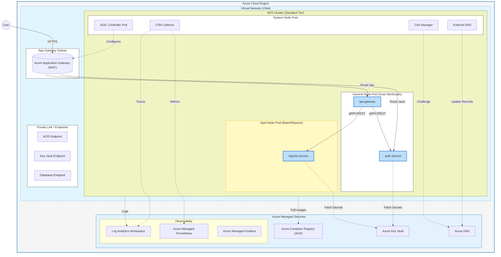

# Azure AKS SaaS Platform Architecture

```mermaid
graph TB
    subgraph Azure_Cloud ["Azure Cloud Region"]
        style Azure_Cloud fill:#f5f5f5,stroke:#0072C6,stroke-width:2px

        subgraph VNet ["Virtual Network (VNet)"]
            style VNet fill:#e1f5fe,stroke:#0072C6,stroke-dasharray: 5 5

            subgraph AppGW_Subnet ["App Gateway Subnet"]
                style AppGW_Subnet fill:#ffffff,stroke:#333
                AppGateway[("Azure Application Gateway (WAF)")]
            end

            subgraph AKS_Cluster ["AKS Cluster (Standard Tier)"]
                style AKS_Cluster fill:#f0f4c3,stroke:#827717
                
                subgraph System_Node_Pool ["System Node Pool"]
                    style System_Node_Pool fill:#ffffff,stroke:#333
                    AGIC_Pod["AGIC Controller Pod"]
                    Cert_Manager["Cert Manager"]
                    Ext_DNS["External DNS"]
                    Otel_Col["OTel Collector"]
                end

                subgraph General_Node_Pool ["General Node Pool (User Workloads)"]
                    style General_Node_Pool fill:#ffffff,stroke:#333
                    API_Gateway["api-gateway"]
                    Auth_Service["auth-service"]
                end

                subgraph Spot_Node_Pool ["Spot Node Pool (Batch/Reports)"]
                    style Spot_Node_Pool fill:#fff9c4,stroke:#fbc02d
                    Reports_Service["reports-service"]
                end
            end
            
            subgraph Private_Link ["Private Link / Endpoints"]
                style Private_Link fill:#ffffff,stroke:#333
                ACR_EP["ACR Endpoint"]
                KV_EP["Key Vault Endpoint"]
                DB_EP["Database Endpoint"]
            end
        end

        subgraph Managed_Services ["Azure Managed Services"]
            style Managed_Services fill:#e3f2fd,stroke:#0072C6
            ACR["Azure Container Registry (ACR)"]
            KeyVault["Azure Key Vault"]
            Azure_DNS["Azure DNS"]
            
            subgraph Observability
                Log_Analytics["Log Analytics Workspace"]
                Prometheus["Azure Managed Prometheus"]
                Grafana["Azure Managed Grafana"]
            end
        end
    end

    %% Traffic Flow
    User((User)) -->|HTTPS| AppGateway
    AppGateway -->|Route /api| API_Gateway
    AppGateway -->|Route /auth| Auth_Service
    
    %% Control Plane
    AGIC_Pod -.->|Configures| AppGateway
    
    %% Service Communication
    API_Gateway -->|gRPC/REST| Auth_Service
    API_Gateway -->|gRPC/REST| Reports_Service
    
    %% Dependencies
    Auth_Service -.->|Fetch Secrets| KeyVault
    Reports_Service -.->|Fetch Secrets| KeyVault
    
    %% Observability Data Flow
    Otel_Col -.->|Metrics| Prometheus
    Otel_Col -.->|Traces| Log_Analytics
    AKS_Cluster -.->|Logs| Log_Analytics
    
    %% Infrastructure
    Ext_DNS -.->|Update Records| Azure_DNS
    Cert_Manager -.->|Challenge| Azure_DNS
    AKS_Cluster -.->|Pull Images| ACR

    classDef service fill:#bbdefb,stroke:#1565c0,stroke-width:2px;
    class API_Gateway,Auth_Service,Reports_Service service;
```
